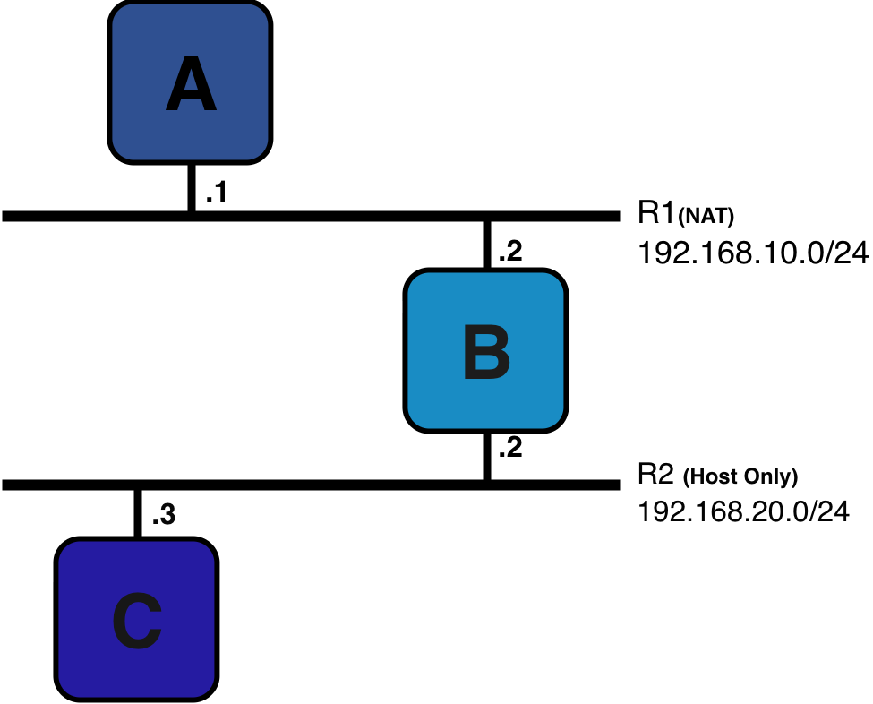
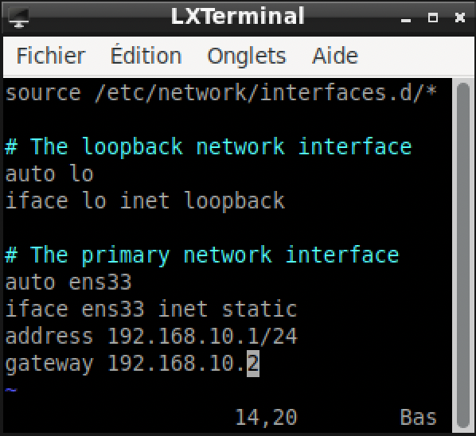
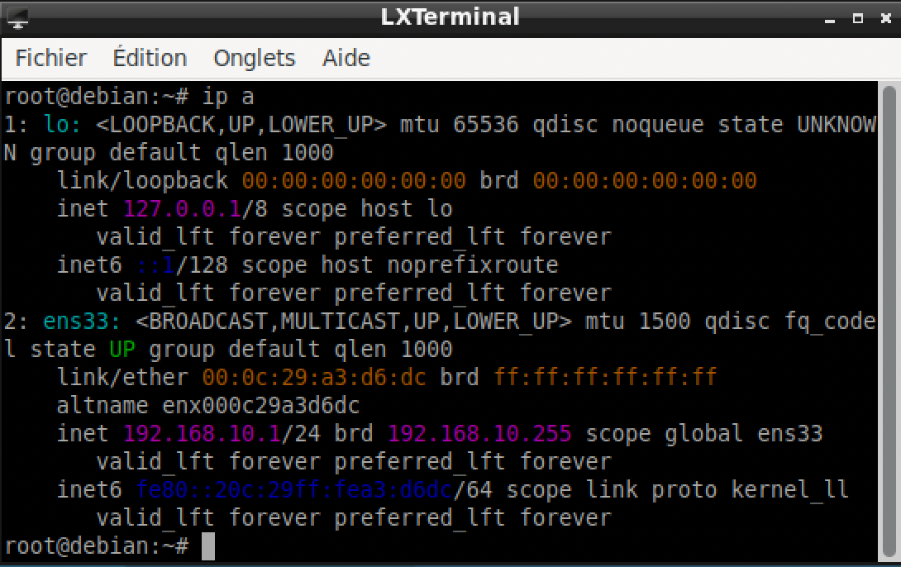

# Projet 1 : Maquette d'un réseau entre 3 machines

## Présentation de la Maquette :

Ce projet a pour but d'avoir une table de routage entre 3 machines A, B et C

Nous savons que les machines A et B sont connectées sur le réseau 1 qui est en NAT ce qui signifie donc qu'elles ont accès à internet et qui a pour adresse réseau 192.168.10.0/24.

Nous avons aussi les machines B et C qui sont elles connectées au réseau 2 qui est en Host Only ce qui signifie qu'elles communiquent uniquement entre elles et avec la machine hôte sans accès à internet et qui a pour adresse réseau 192.168.20.0/24.

La machine B est connectée aux 2 réseaux et elle a donc 2 cartes réseau dont une qui est sur le R1 et l'autre sur le R2. Comme nous avons les machines A et C qui ne sont pas sur le même réseau elles ne peuvent pas communiquer directement entre elles, elles sont obligées de passer par la machine B car la machine B est la seule machine présente sur les 2 réseaux. C'est pour cela que le RPD (Routeur Par Défaut) de A est B et celui de C est B aussi.

## Configuration des 3 machines :

### Configuration d'une interface :

Alors pour configurer l'interface de notre machine on doit mettre notre configuration dans le fichier interfaces à l'emplacement `/etc/network/interfaces` et pour pouvoir l'éditer j'utilise vi (vim),
donc je tape `vi /etc/network/interfaces` et là je peux ajouter mes configurations que je souhaite mettre.

### Pour la machine A :

on mettra d'abord dans nos configurations `auto ens33` afin qu'à chaque démarrage de la machine les configurations ens33 qu'on aura faites se mettront automatiquement, ens33 est le nom que Linux donne à notre carte réseau, ce nom dépend du slot de la carte dans la machine. En faisant `ip a` on a pu constater qu'il y a 2 interfaces le lo et le ens33 ce qui est normal car on a bien qu'une carte réseau et la première interface est toujours là, c'est notre interface de bouclage. A la suite on met `iface ens33 inet static`, iface pour notre interface ens33, inet signifie qu'on va le configurer en ipv4 et le static car on les met manuellement.

Ensuite `address 192.168.10.1/24` on met l'adresse de notre machine nous constatons qu'elle est bien sur R1 (192.168.10.0/24), et pour finir on met `gateway 192.168.10.2` ce qui signifie qu'on a créé un chemin vers une machine qui a cette adresse ce qui correspond à la machine B

Maintenant qu'on a bien mis nos configurations, on a juste à faire `ifup ens33` pour bien exécuter nos configurations de notre interface ens33.

En faisant `ip a`, cela va afficher directement nos interfaces :

Mais aussi en faisant `ip route`, nous voyons directement les routes de notre machine vers d'autres machines dans notre cas par exemple :

Nous voyons clairement que la configuration de notre interface ens33 a bien été appliquée, que maintenant l'adresse ip de notre machine est 192.168.10.1/24, qu'elle est bien sur le réseau et que son routeur par défaut est bien 192.168.10.2 qui est la machine B.

### Pour la machine C :

on mettra d'abord dans nos configurations `auto ens33` afin qu'à chaque démarrage de la machine les configurations ens33 qu'on aura faites se mettront automatiquement, ens33 est le nom que Linux donne à notre carte réseau, ce nom dépend du slot de la carte dans la machine. En faisant `ip a` on a pu constater qu'il y a 2 interfaces le lo et le ens33 ce qui est normal car on a bien qu'une carte réseau et la première interface est toujours là, c'est notre interface de bouclage. A la suite on met `iface ens33 inet static`, iface pour notre interface ens33, inet signifie qu'on va le configurer en ipv4 et le static car on les met manuellement.

Ensuite `address 192.168.20.3/24` on met l'adresse de notre machine nous constatons qu'elle est bien sur R2 (192.168.20.0/24), et pour finir on met `gateway 192.168.20.2` ce qui signifie qu'on a créé un chemin vers une machine qui a cette adresse ce qui correspond à la machine B

Maintenant qu'on a bien mis nos configurations, on a juste à faire `ifup ens33` pour bien exécuter nos configurations de notre interface ens33.

En faisant `ip a`, cela va afficher directement nos interfaces :

Mais aussi en faisant `ip route`, nous voyons directement les routes de notre machine vers d'autres machines dans notre cas par exemple :

Nous voyons clairement que la configuration de notre interface ens33 a bien été appliquée, que maintenant l'adresse ip de notre machine est 192.168.20.3/24, qu'elle est bien sur le réseau et que son routeur par défaut est bien 192.168.20.2 qui est la machine B.
