# Projet 1 :Maquette d’un réseau entre 3 machines

## Présentation de la Maquette :

Ce projet a pour but d’avoir une table de routage entre 3 machines A, B et C

Nous savons que les machines A et B sont connectées sur le réseau 1 qui est en NAT ce qui signifie donc qu’elles ont accès à internet et qui a pour adresse réseau 192.168.10.0/24.

Nous avons aussi les machines B et C qui sont elles connectées au réseau 2 qui est en Host Only ce qui signifie qu’elles communiquent uniquement entre elles et avec la machine hôte sans accès à internet et qui a pour adresse réseau 192.168.20.0/24.

La machine B est connectée aux 2 réseaux et elle a donc 2 cartes réseau dont une qui est sur le R1 et l’autre sur le R2. Comme nous avons les machines A et C qui ne sont pas sur le même réseau elles ne peuvent pas communiquer directement entre elles, elles sont obligées de passer par la machine B car la machine B est la seule machine présente sur les 2 réseaux. C’est pour cela que le RPD (Routeur Par Défaut) de A est B et celui de C est B aussi.

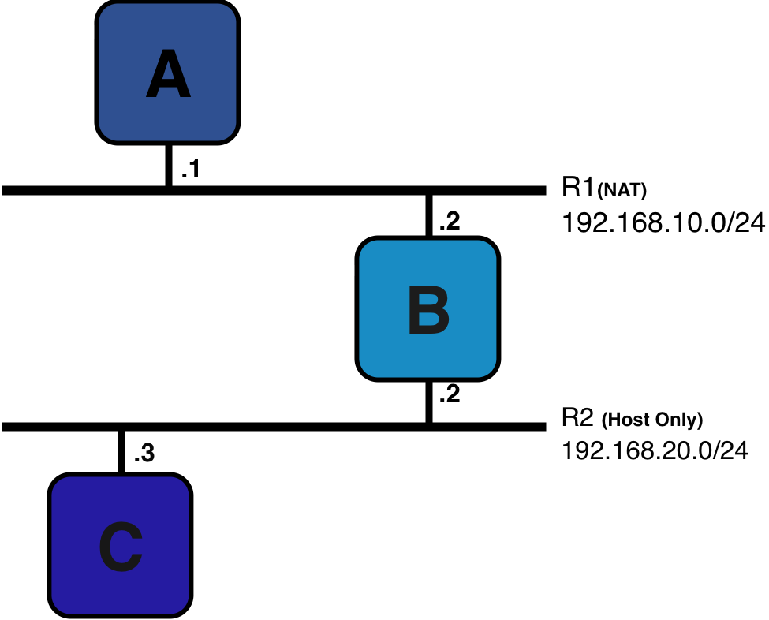

## Configuration des 3 machines :

### Configuration d’une interface :

Alors pour configurer l’interface de notre machine on doit mettre notre configuration dans le fichier interfaces à l’emplacement /etc/network/interfaces et pour pouvoir l’éditer j’utilise vi (vim),
donc je tape vi /etc/network/interfaces et là je peux ajouter mes configurations que je souhaite mettre.

### Pour la machine A :

on mettra d’abord dans nos configurations **auto ens33** afin qu’à chaque démarrage de la machine les configurations ens33 qu’on aura faites se mettront automatiquement, ens33 est le nom que Linux donne à notre carte réseau, ce nom dépend du slot de la carte dans la machine. En faisant ip a on a pu constater qu’il y a 2 interfaces le lo et le ens33 ce qui est normal car on n’a bien qu’une carte réseau et la première interface est toujours là, c’est notre interface de bouclage. A la suite on met **ifaceens33 inet static**, iface pour notre interface ens33, inet signifie qu’on va la configurer en ipv4 et le static car on les met manuellement.
Ensuite **address 192.168.10.1/24** on met l’adresse de notre machine nous constatons qu’elle est bien sur R1 (192.168.10.0/24), et pour finir on met **gateway 192.168.10.2** ce qui signifie qu’on a créé un chemin vers une machine qui a cette adresse ce qui correspond à la machine B

Maintenant qu’on a bien mis nos configurations on a juste à faire **ifup ens33** pour bien exécuter nos configurations de notre interface ens33.
En faisant **ip a,** cela va afficher directement nos interfaces :

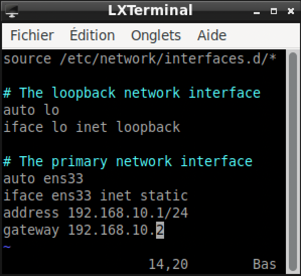

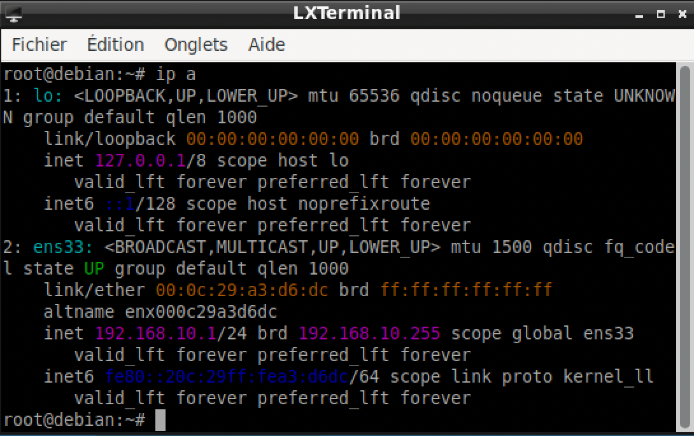

Mais aussi en faisant **ip route**, nous voyons directement les routes de notre machine vers les autres machines dans notre cas par exemple :

Nous voyons clairement que les configurations de notre interface ens33 ont bien été appliquées, que maintenant l’adresse ip de notre machine est 192.168.10.1/24, qu’elle est bien sur le réseau et que aussi son routeur par défaut est 192.168.10.2 qui est la machine B.

### Pour la machine B :

Comme vu dans notre maquette la machine B est sur 2 réseaux à la fois et c’est complètement normal car elle a 2 cartes réseau la première ens33 qui elle est connectée au R1 et comme R1 est en NAT cette carte réseau l’est aussi et notre deuxième carte réseau ens36 est connectée à R2 et comme R2 est en Host Only cette carte réseau l’est aussi.

Tout d’abord on commence par la configuration de la première carte réseau qui est ens33, on fait comme tout à l’heure, on fait **auto ens33** pour qu’au démarrage on ait bien nos configurations, ensuite on fait **iface ens33 inet static** afin de configurer notre interface ens33 avec nos configurations, on met **address 192.168.10.2/24,** et on remarque bien que cette carte réseau est connectée à R1 car le troisième chiffre de son adresse, 10, correspond à notre réseau 1 (192.168.10.0/24), et le dernier chiffre, 2, correspond à l’ip de la machine B sur ce réseau

Maintenant on fait la même chose mais pour ens36, on fait **auto ens36**, ensuite **iface ens36 inet static**, **address 192.168.20.2/24,** et on remarque que cette carte réseau est bien connectée à R2 car le réseau 2 a pour adresse réseau 192.168.20.0/24.

Comme vous l’avez pu remarquer on n’a pas eu besoin de faire le RPD (**gateway**) car ce sont les machines A et C qui auront leur route par défaut vers B donc quand on fait ce gateway le chemin est créé et donc pas besoin de le recréer en B.

Maintenant qu’on a bien mis nos configurations on a juste à faire **ifup ens33** pour bien exécuter nos configurations de notre interface ens33 et aussi **ifup ens36** pour bien exécuter nos configurations de notre interface ens36
En faisant **ip a,** cela va afficher directement nos interfaces :

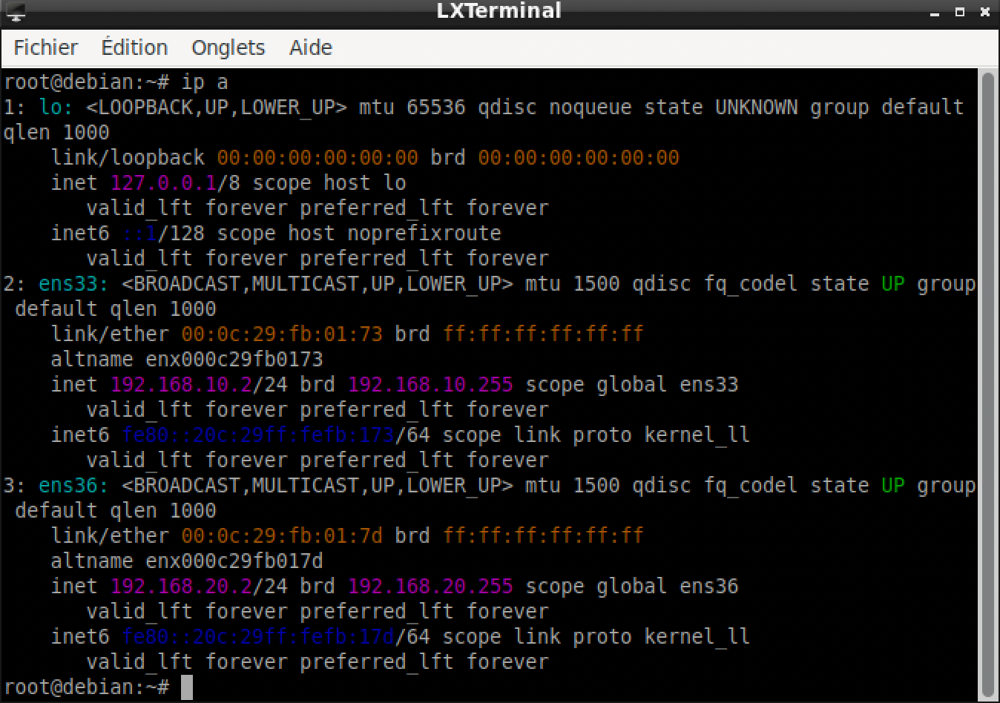

Mais aussi en faisant **ip route**, nous voyons directement les routes reliées à notre machine :

Comme on peut le voir avec notre première carte réseau ens33 connectée en R1 et que la deuxième carte réseau ens36 est connectée en R2 sont eux deux en **proto kernel scope** : le noyau les a créées tout seul à partir des adresses en /24 et le **scope link** signifie que les machines de ces réseaux sont liées donc à la machine A en ens33 et à la machine C en ens36 et que donc à partir de B on peut parler à ces deux machines.

### Pour la machine C :

Pour la machine C on va faire pareil que pour la machine A juste maintenant nous sommes sur R2 et la machine B est aussi sur R2 et son RPD sera donc la machine B. Dans l’interface on met donc **auto ens33** comme d’habitude et ensuite **ifaceens33 inet static**, ça reste toujours la même interface ens33 qui est notre carte réseau.

Là on met **address 192.168.20.3/24** vu que notre machine est bien sur le réseau 192.168.20.0/24 (R2), et pour le gateway on met **192.168.20.2** ce qui correspond à la machine B qui est notre RPD pour cette machine aussi.

Une fois qu’on a fait **ifup ens33** pour exécuter nos configurations, en faisant **ip a** on voit bien que ça a été appliqué et que notre interface ens33 a maintenant bien cette adresse :

Et en faisant **ip route** ça nous montre les routes que notre machine a vers les autres machines dans notre cas :

Donc pour conclure on voit bien que les configurations de notre interface ens33 sont bonnes, que l’adresse ip est bien 192.168.20.3/24 et que son routeur par défaut est bien 192.168.20.2 qui correspond à la machine B.

**Question**: Comment pouvez-vous savoir, quelle carte réseau linux de B est la carte en mode HostOnly et quelle carte réseau linux de B est en mode NAT ? Ainsi, si les 2 cartes vues par Linux sont appelées ens33 et ens37 (le nom dépend de votre version de vmware). Comment savoir si c’est ens33 qui est en NAT ou si c’est ens37 ?

### Ma méthode pour vérifier quelle carte est en mode NAT et l’autre en Host Only :

Alors tout d’abord il faut comprendre le raisonnement de ce qu’est une carte en mode NAT et Host Only.

NAT : la machine virtuelle passe par la machine hôte pour accéder à Internet.

Host-Only : le réseau est FERMÉ, les machines ne peuvent donc communiquer seulement entre elles et avec la machine hôte sans aucune sortie vers Internet.

Alors maintenant nous allons vérifier par exemple sur la machine B qui a 2 cartes réseau, une en mode NAT et l’autre en Host Only. Nous avons vu que quand on fait un **ip a** sur la machine B nous voyons que chaque carte réseau, ens33 et ens36, a sa propre adresse MAC.

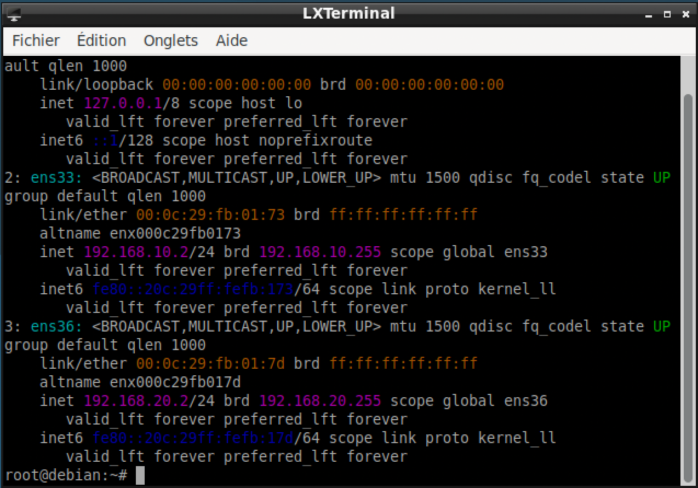

Nous voyons que l’adresse MAC de ens33 est **00:0c:29:fb:01:73**.

Maintenant qu’on a l’adresse MAC de la ens33, on regarde dans les paramètres de VMware, notamment sur la configuration de l’une des cartes réseau.

Nous voyons que la première carte réseau est en NAT, nous allons essayer de voir l’adresse MAC de cette carte réseau pour voir à laquelle elle correspond.

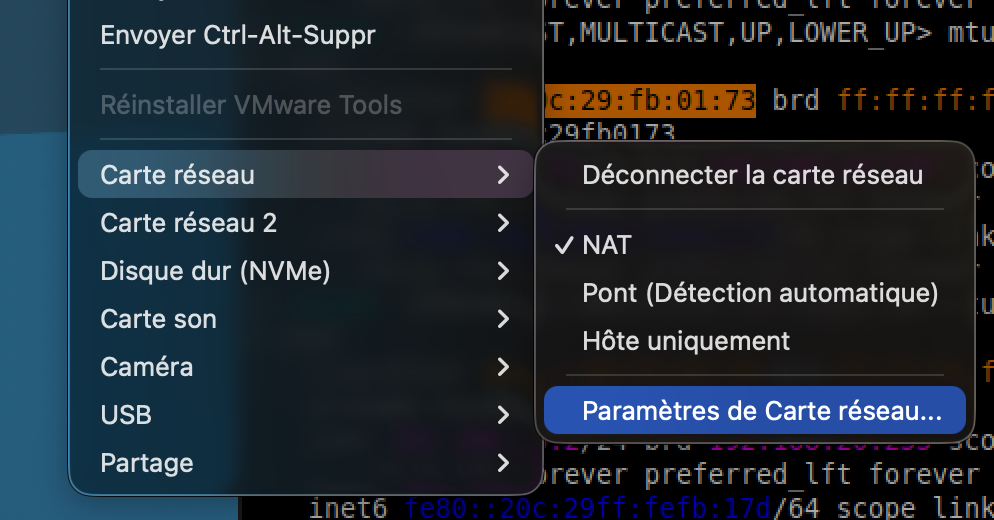

Nous remarquons que l’adresse MAC de la carte réseau qui est en NAT correspond à l’adresse MAC de ens33, donc ens33 est bien la carte réseau en NAT, et donc que ens36 est bel et bien la carte réseau Host Only.

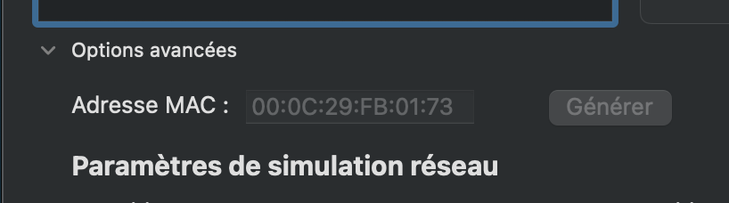

**ADRESSE MAC DE ENS33 : 00:0c:29:fb:01:73**

## Pouvoir faire en sorte que A puisse faire un ping vers C :

Notre objectif ici maintenant qu’on a configuré nos cartes réseau de nos 3 machines est de pouvoir faire en sorte qu’elles puissent s’envoyer des paquets entre elles.

Actuellement sans avoir fait aucun changement si on souhaite de la machine A faire un ping à la machine C, ça ne marchera pas, chacun de nos paquets ne sera jamais reçu par la machine C.

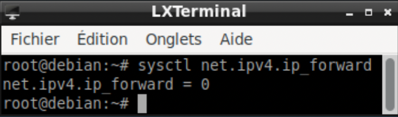

Cela est lié à un problème, en faisant **sysctl net.ipv4.ip_forward** cela on fera que son statut sera 0, cela veut dire que ip_forward ne nous donne pas cette autorisation et donc 0 car c’est un booléen donc 0 pour false et nous on veut avoir cette autorisation.

Sans cette autorisation dans notre cas A va envoyer un paquet à son RPD qui est en R1 et qui est la machine B donc ce paquet sera reçu sur ens33 mais le problème est que ce paquet a pour destination une machine qui est sur le un autre réseau (R2) et c’est là qu’entre en jeu cette autorisation, cette autorisation nous dit si on a le droit d’envoyer ce paquet là vers son autre carte réseau (ens36) car elle est sur R2.

Du coup, dans le cas où on a notre autorisation, la machine B va regarder sa table de routage et va donc décider de l’envoyer ce paquet à ens36 qui est elle en R2 comme destination de ce paquet et donc ens36 va pouvoir envoyer ce paquet à sa destination sans soucis.

Alors pour pouvoir mettre cette autorisation à 1 pour qu’elle marche même en redémarrant la machine, j’ai créé un **.conf** que j’ai appelé par défaut **99-routage.conf** dans le dossier **sysctl.d**, c’est là-dedans que va s’appliquer cette autorisation.

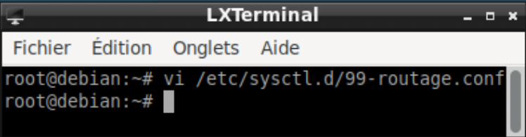

Maintenant qu’il a été créé, je peux mettre cette autorisation dans notre **99-routage.conf**
je vais tout simplement mettre dedans **net.ipv4.ip_forward=1** afin de bien activer notre autorisation en la mettant à 1.

C’est bon, on a cette autorisation, maintenant on peut en revérifier le statut en faisant la même commande **sysctl net.ipv4.ip_forward** et on verra bien qu’il sera à 1.

Maintenant qu’on a cette autorisation, on pourra envoyer nos paquets de la machine A à la machine C tout en passant par la machine B.

**Question** : on vous demande d’expliquer ce que permet de vérifier chacune des 3 étapes décrites ci-dessus. On part du principe qu’une étape n’est testée que si les précédentes sont OK.

On peut faire un ping de A vers B/R1 et que ça soit OK :

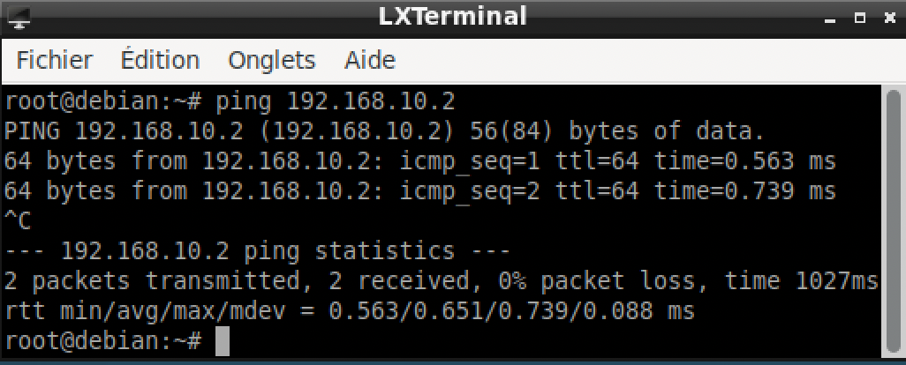

On vérifie bien que A et B communiquent bien sur R1. Elles sont sur le même réseau, donc il n’y a aucun routage.

On peut faire un ping de A vers B/R2 et que ça soit OK :

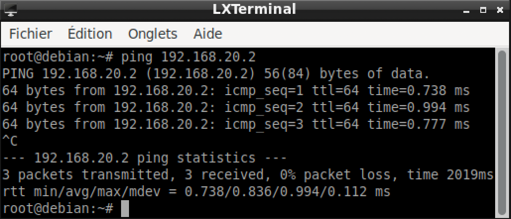

On vérifie que A peut envoyer des paquets sur un autre réseau que celui sur lequel elle est actuellement, on vise bien B mais pas pour destination R1 mais bien R2, donc on doit passer par son RPD et par la carte ens36 de B. Le paquet s’arrête sur B qui répond elle-même.

On peut faire un ping de A vers C/R2 et que ça soit OK :

On vérifie que le routage fonctionne. Le paquet traverse vraiment B : il entre par ens33 et ressort par ens36, ce test valide **ip_forward** sur B et le RPD de C.

Si le test 3 échoue alors que les 2 premières sont OK, alors on saura que le problème vient soit d’**ip_forward** sur B, soit du RPD de C.

**Question** : est-il intéressant de vérifier aussi que depuis C, un ping vers 192.168.10.1 (A) est OK ?

Non, il n’est pas intéressant de le vérifier.

Car si en partant de la machine A on ping la machine C le paquet va partir de la machine A, va passer par son RPD donc par B/R1.

Ensuite la machine B va regarder sa table de routage car le paquet est destiné à une machine sur R2 il va envoyer le paquet à son ens36 qui va l’envoyer à la machine C/R2.

Et si ce paquet est bien reçu par C, une réponse que C fabrique sera envoyée dans le sens inverse par le même chemin vers la machine A.

## Trajet d’un paquet “ping” de A à C : IP, MAC et TTL

On va s’intéresser au trajet d’un ping de A vers C. Comme dit avant, l’envoi d’un paquet “ICMP echo request“ se fait par la machine A qui est la machine qui envoie ce paquet, et en retour la machine C qui a reçu ce paquet envoie un paquet “ICMP Echo Réponse“, la commande **ping 192.168.20.3** en étant dans la machine A affichera le temps d’aller-retour :

### Nous allons donc étudier le trajet d’un paquet de A à C :

### 1) Décisions de routage déterminant ce trajet à chaque étape

### Décision sur A :

A veut joindre 192.168.20.3 (la machine C) et pour le faire elle regarde sa table de routage :

Elle va comparer la destination de ce paquet à ce qu’elle connaît : la destination de ce paquet n’est pas dans l’adresse réseau de notre machine, donc pas dans 192.168.10.0/24. Ce qui signifie qu’elles ne sont pas voisines directes, il ne restera donc que le RPD.
Sa décision sera d’envoyer le paquet à la machine B en R1 via ens33 donc par son RPD.

### Décision arrivée sur B :

B va donc recevoir le paquet sur ens33, elle va regarder d’abord l’adresse de destination de ce paquet et verra que cette adresse ne correspond pas à la sienne et que cette adresse ne fait pas partie du réseau sur lequel elle est actuellement (R1), comme ip_forward est à 1 elle peut donc consulter sa table :

Comme on peut le voir, l’ip de la machine C (192.168.20.3) fait partie de l’adresse réseau de R2 accessible directement par ens36. Elle va donc faire sortir le paquet par ens36 directement vers C.

### Arrivée sur C :

C reçoit alors ce paquet, il voit qu’il a pour destination sa machine donc pas de décision de routage, puis il va fabriquer sa réponse, le “ICMP Echo Réponse“, qu’il va envoyer à la machine A, celle qui avait initialement envoyé le paquet, et pour envoyer cette réponse il va regarder sa table et va voir que la destination de cette réponse n’est pas dans son réseau actuel, alors, ce qu’il va faire, il va donc utiliser son RPD qui est la machine B/R2, puis B va décider de faire sortir le paquet par ens33, ça a été la même chose que l’envoi du paquet mais dans le sens inverse de C à A.

### 2) Faire 2 captures de trame : une sur R1 et une sur R2

Vous pouvez aller voir les 2 captures de trame, ce sont les 2 .pcapng directement consultables avec Wireshark.

Mais aussi voici les captures :

### La capture sur ens33 :

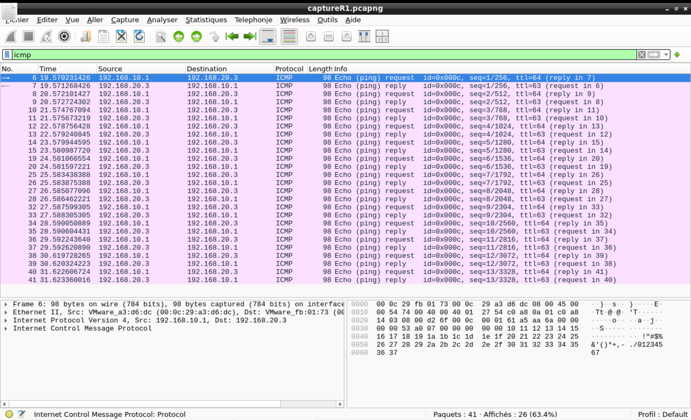

### La capture sur ens36 :

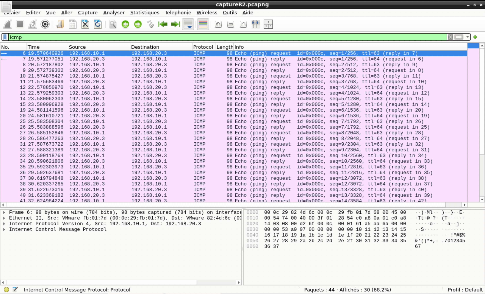

### 3) Repérer un paquet sur R1 et son équivalent sur R2 (expliquez pourquoi le paquet que vous choisissez sur R2 est celui qui réalise la fin du trajet de A à C)

Je choisis le paquet 8 sur R1 et on va voir son équivalent sur R2 et on y répondra à la question.

Comme on peut le voir sur cette capture, la trame 8 est un Echo request de 192.168.10.1 (A) vers 192.168.20.3 (C) avec **id=0x000c**, **seq =2/512** et **TTL=64**

Ici on peut voir que ce paquet de notre trame de R2 correspond au même paquet identifié juste avant, comment on le sait ? Car ce paquet là est un request comme celui de R1, mais aussi que son numéro de séquence est **seq=2/512**, c’est grâce à celui-ci qu’on l’identifie car le numéro de paquet s’incrémente entre chaque paquet envoyé, donc ce paquet là est bien le paquet identifié juste avant.
On peut voir aussi que l’identifiant est le même, l’identifiant et le numéro de séquence sont générés par A et ne sont jamais modifiés par un routeur, donc 2 paquets ayant les mêmes sont forcément les mêmes. Comme on peut le voir, le TTL passe de 64 à 63, c’est ce qui confirme que c’est un paquet après son passage par B.

Donc ce paquet là sur R2 est bien celui qui réalise la fin du trajet de A à C car :

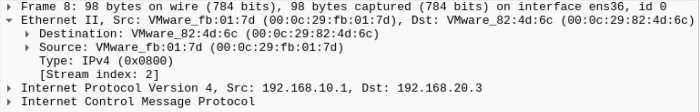

Comme on peut le voir sur Wireshark, sur ce paquet là, sa destination a pour adresse MAC (**00:0c:29:82:4d:6c**)

Et quand on fait ip a sur C, on peut voir ici que cette adresse MAC correspond à la machine C. Les 2 sont identiques donc le paquet est adressé directement à C et non à une autre machine.

Une adresse MAC de destination désigne toujours la prochaine machine qui doit recevoir ce paquet, sur R1 c’était celle de B donc le paquet devrait encore être relayé, ici c’est celle de C, il n’y a donc pas d’intermédiaire.

### 4) Etudier et expliquer les modifications (ou non) des champs TTL, IP SRC et DST, MAC SRC et DST

TTL : il diminue de 1, comme dit juste avant, à chaque routeur traversé il sera décrémenté. Cela permet de prouver qu’exactement un routeur a été traversé par un paquet, ce routeur là est bien la machine B. TTL a pour but d’être une sécurité : si un paquet tournait en boucle entre des routeurs mal configurés, le TTL finirait par atteindre 0 et le paquet serait détruit ; sans cela, le paquet circulerait sans jamais s’arrêter

IP SRC et DST : Les IP ne changent pas à l’envoi du paquet et cela est logique, une IP a été affectée à une machine et restera la même car ça l’identifie en quelque sorte. C’est 2 IP à 2 buts : l’IP SRC a pour but de désigner l’IP d’origine et l’IP DST a pour but de désigner l’IP destinataire final, si B les modifiait, C ne saurait plus à qui répondre, c’est pour cela qu’elles ne sont pas modifiées car sans cela on ne pourrait pas faire acheminer ce paquet de bout en bout à travers plusieurs routeurs.

MAC SRC et DST : Oui, elles vont changer car une adresse MAC est une adresse spécifique à sa carte réseau et ne changera jamais. Si on envoie un paquet de A à B/ens33, l’adresse MAC SRC sera celle de A car c’est d’où le paquet est envoyé, et DST celle de B/ens33 car c’est elle qui est la destination de ce paquet. Mais dans le cas où on envoie un paquet de B/ens36 à C, alors là, l’adresse MAC SRC sera celle de B/ens36 et celle de DST sera celle de C. C’est pour cela que les adresses MAC SRC et DST vont varier en fonction de la machine vers laquelle on envoie un paquet et de son destinataire. Car une adresse MAC ne fonctionne que sur un seul réseau, A ne peut pas connaître le MAC de C car C n’est pas sur son réseau, elle envoie donc à son voisin B qui va fabriquer une nouvelle trame avec des adresses de R2 pour l’envoyer à C qui est lui sur R2.

### Nous allons donc étudier le trajet d’un paquet retour de C à A :

Nous allons suivre le retour donc un paquet echo reply (ICMP Echo Reponse), on va prendre celui qu’on vien d’étudier donc le seq=2/512 ce qui correspond a la trame 9.

### 1) Décisions de routage déterminant ce trajet à chaque étape

Maintenant on va faire le echo reply, c’est la même chose que le request mais dans le sens inverse, de notre destination vers notre machine A.

C veut envoyer une réponse à A, elle va regarder sa table de routage et voit que l’adresse de destination de la machine A n’est pas sur son réseau, du coup C va passer par son RPD (la machine B).

B reçoit le paquet sur ens36 et voit que l’adresse de destination n’est pas sur son réseau actuel, comme on a l’autorisation de l’ip_forward, B consulte sa table et voit que R1 est accessible par ens33 et que l’ip destination correspond à une machine sur R1, et va donc faire sortir le paquet par ens33 vers A.

### 2) Faire 2 captures de trame : une sur R1 et une sur R2

Ce sont les mêmes 2 captures que pour l’aller, les 2 .pcapng sur R1 et sur R2, car l’echo request et l’echo reply se trouvent dans la même capture. Ici on regarde donc les lignes qui partent de 192.168.20.3 (C) vers 192.168.10.1 (A), c’est-à-dire les echo reply :

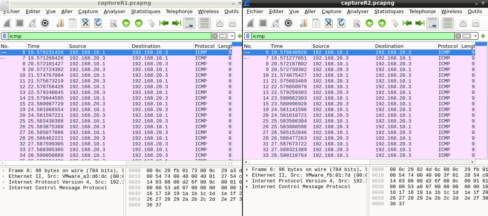

### 3) Repérer un paquet sur R1 et son équivalent sur R2 (expliquez pourquoi le paquet que vous choisissez sur R2 est celui qui réalise la fin du trajet de A à C)

Je choisis la trame 9, un echo reply, et ça correspond bien à la réponse du paquet envoyé qu’on venait juste d’étudier, car on peut voir que son seq=2/512 comme l’echo request étudié juste au-dessus.

Sur R1 :

Son équivalent sur R2 :

Comme on peut le voir sur ces captures, la trame 9 est un Echo reply de 192.168.20.3 (C) vers 192.168.10.1 (A) avec **id=0x000c**, **seq=2/512**, et un **TTL=64** sur R2 au départ de C qui passe à un **TTL=63** sur R1, vu qu’il a traversé le routeur B.

Pourquoi c’est bien la fin du trajet : Nous voyons que sur R1 l’adresse MAC de destination est celle de A. Une adresse MAC de destination désigne toujours la prochaine machine qui reçoit le paquet, et ici c’est directement A. Le paquet est donc remis à sa destination finale.

### 4) Etudier et expliquer les modifications (ou non) des champs TTL, IP SRC et DST, MAC SRC et DST

Le comportement est le même qu’à l’aller, seul le sens change.

TTL : il diminue de 1, car le paquet a traversé un routeur, la machine B. La valeur de départ est cette fois fixée par C, puisque c’est elle qui fabrique ce nouveau paquet.

IP SRC et DST : elles ne changent pas, mais elles sont inversées par rapport à l’aller, puisqu’il s’agit d’une réponse. L’IP SRC est maintenant celle de C (192.168.20.3) et l’IP DST celle de A (192.168.10.1). Elles restent intactes tout au long du trajet car elles désignent l’origine et le destinataire final.

MAC SRC et DST : elles changent entre les deux réseaux. Sur R2 la trame va de C à B/ens36, sur R1 elle va de B/ens33 à A. C’est le même principe qu’à l’aller : une adresse MAC ne fonctionne que sur un seul réseau, donc C envoie à son voisin B, qui fabrique ensuite une nouvelle trame avec des adresses de R1 pour l’envoyer à A.

## Trajet d’un paquet “ssh” de A à C : IP, MAC et TTL

On va s’intéresser au trajet d’un paquet “ssh“ de A à C. ssh est un protocole qui permet de se connecter à une autre machine depuis sa propre machine. ssh s’appuie sur TCP, avec le SYN, SYN/ACK, ACK : TCP garantit que toutes les données sont transmises complètement et dans l’ordre où elles ont été envoyées. Et ssh, de son côté, chiffre les échanges.

Voici comment je fais la connexion ssh à partir de A pour me connecter à la machine C :

D’abord il faudra faire en sorte que les permissions de se connecter en tant que root soient bien mises, pour pouvoir les mettre je vais directement dans le fichier **sshd_config** et pour y accéder je fais **vi /etc/ssh/sshd_config** et on met les permissions :

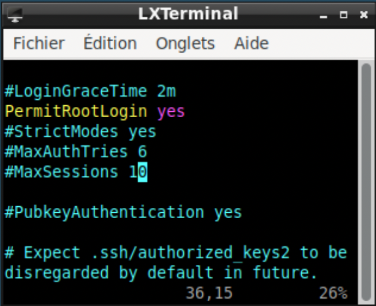

Là on voit qu’on a bien mis PermitRootLogin à yes.

Ensuite on redémarre le service afin que ça fasse effet en faisant : **systemctl restart ssh**.

Je regarde si on peut bien se connecter à C en regardant le **systemctl status ssh** directement sur C afin de constater qu’il est bien activé.

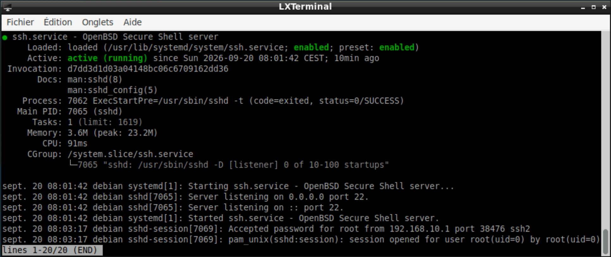

Et ensuite sur A on fait **ssh root@192.168.20.3** afin de demander la connexion à C. On nous demande le mot de passe, on le met, et on sera bien dans C. On peut le confirmer en faisant ip a, on voit bien qu’on est bien sur la machine C.

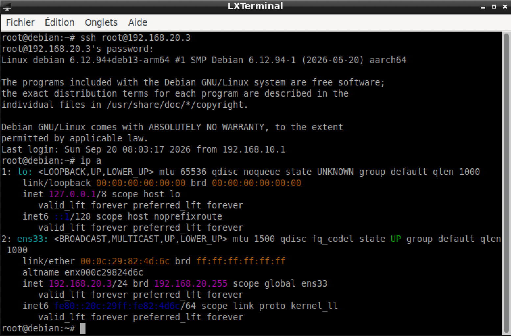

### Nous allons donc étudier le trajet d’un paquet ssh de A à C :

### 1) Décisions de routage déterminant ce trajet à chaque étape

Les décisions de routage sont exactement les mêmes que pour les ping.

A veut joindre la machine C, qui a donc pour destination 192.168.20.3. Elle regarde sa table de routage et remarque que cette adresse n’est pas une machine de son adresse réseau, elle va donc envoyer le paquet à son RPD qui est B/R1.

B va donc recevoir ce paquet venant de A, et ce paquet a pour destination 192.168.20.3. Elle voit que l’adresse de destination n’est pas sur le même réseau que lui, et comme **ip_forward=1** alors elle consulte sa table et voit que cette destination est accessible à partir de ens36, comme ens36 est sur le même réseau que notre destination, elle va donc faire sortir ce paquet par ens36 vers C.

Les décisions sont identiques parce que, pour la transmission d’un paquet, un routeur regarde uniquement l’ip de destination.

### 2) Faire 2 captures de trame : une sur R1 et une sur R2

Vous pouvez aller voir les 2 captures de trame, ce sont les 2 .pcapng directement consultables avec Wireshark.

Mais aussi voici les captures :

### La capture sur ens33 :

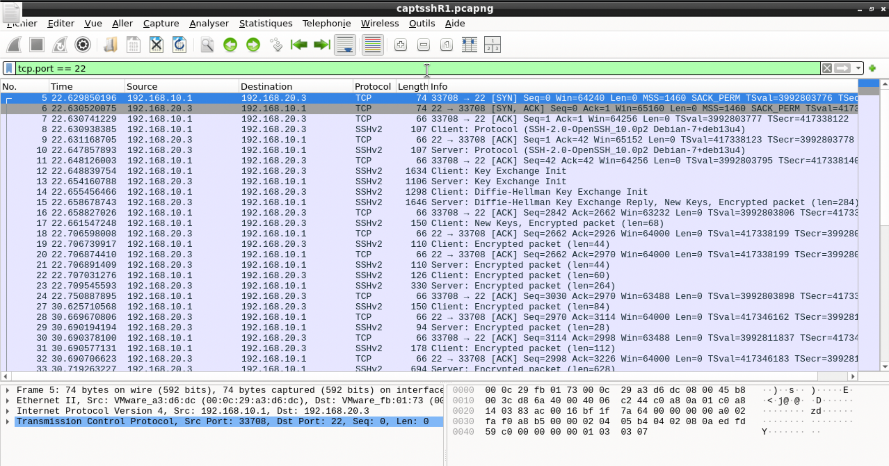

### La capture sur ens36 :

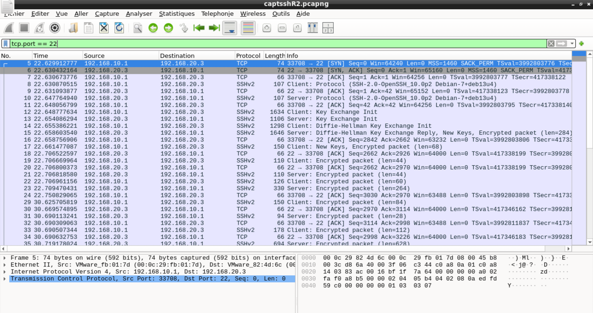

### 3) Repérer un paquet sur R1 et son équivalent sur R2 (expliquez pourquoi le paquet que vous choisissez sur R2 est celui qui réalise la fin du trajet de A à C)

Voici le paquet choisi :

Ce paquet est celui de la trame 5, c’est le SYN, le tout premier paquet de la connexion ssh, qui part de A vers C.

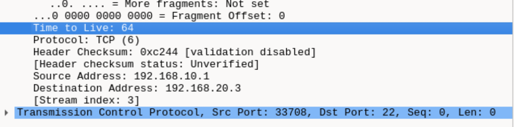

**Src port : 33708, Dst Port : 22**, **seq 0** et **TTL 64**

Et voici son équivalent sur ens36 :

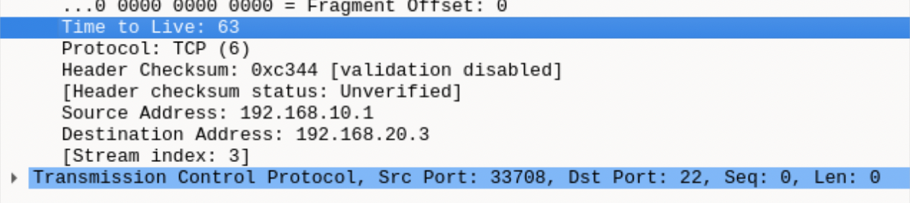

On peut voir qu’ils ont bien les mêmes ports, le même seq, et aussi que maintenant le TTL est à 63. Donc c’est bien le même paquet, juste après que B a regardé sa table de routage et a décrémenté le TTL.

### Pourquoi c’est bien la fin du trajet :

Car sur R2 on peut voir que l’adresse MAC de destination est 00:0c:29:82:4d:6c, qui est celle de C. Une adresse MAC de destination désigne toujours la prochaine machine qui doit recevoir le paquet, et ici on voit que l’adresse MAC de destination est celle de C, donc cela signifie que le paquet a pour destination directement C et que c’est bien la destination finale.

### 4) Etudier et expliquer les modifications (ou non) des champs TTL, IP SRC et DST, MAC SRC et DST

Le comportement de chacun des champs est exactement le même que celui pour le ping :

IP : elles ne changent pas, l’IP SRC désigne l’ip de départ, dans notre cas 192.168.10.1 (A), d’où le paquet est envoyé vers sa destination avec son IP DST 192.168.20.3 (C).

MAC : Comme on a pu le voir, les adresses MAC changent bien, car l’adresse MAC SRC sur R1 de A à B sera donc celle de A et celle de DST sera celle de B, tandis que sur R2 ça sera celle de B à C.

TTL : Ici on a bien le TTL qui va se décrémenter car notre routeur B a bien été traversé.

Nous pouvons bien voir que le comportement de transmission de paquet est identique à celui d’un ping. Cela prouve que si un paquet part d’une machine vers une machine destination, le routage se fait toujours de la même façon pour tout type de paquet, que ce soit des ping ou bien la transmission ssh.
